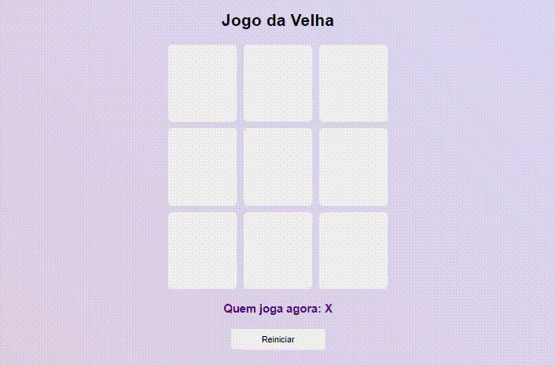
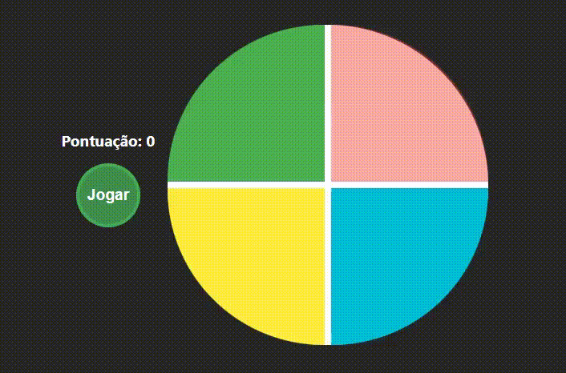
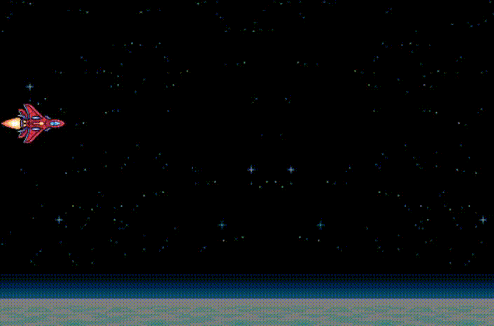
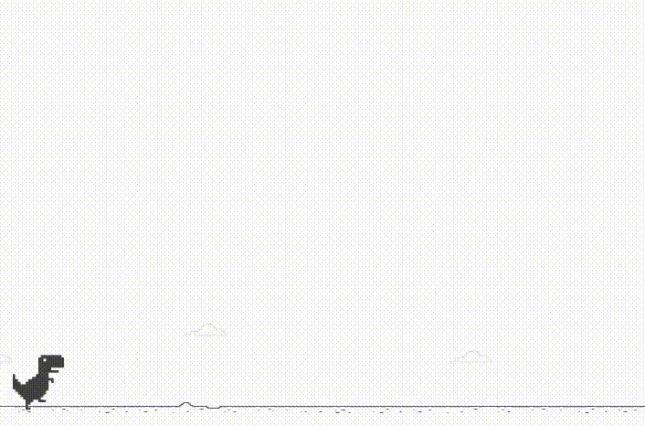

  
<h1 align="center">Órbi Web Games Developer</h1>

  

Bootcamp realizado em parceria com a [Digital One Innovation](https://dio.me) para desenvolvimento de jogos para a web utilizando os fundamentos de HTML, CSS e JavaScript. Em todas as etapas do projeto adicionei novas funcionalidades aos games, tanto em termos técnicos quando visuais, aprimorando as experiência dos usuários e desenvolvendo ainda mais o aprendizado. Confira abaixo a lista com todos os projetos:

## 1. Clássico jogo da velha | [JOGAR](https://rawcdn.githack.com/FernandoBade/orbi-web-games-developer/eed9d9efe251064919ce88184015a37cfa456888/jogo-da-velha/index.html)

Primeiro projeto do bootcamp com o objetivo de criar uma versão online do clássico jogo da velha, com implementações lógicas simples que verifica se as jogadas são idênticas e devolve o resultado da vitória ou derrota.

## 2. Jogo da memória, estilo Genius | [JOGAR](https://rawcdn.githack.com/FernandoBade/orbi-web-games-developer/eed9d9efe251064919ce88184015a37cfa456888/genius-jogo-memoria/index.html)

Recriando uma versão online do clássico brinquedo Genius, onde o computador informa uma ordem de cores que aumenta a cada rodada e o jogador deve decorar e reproduzir a ordem corretamente para continuar jogando.

## 3. Space Shooter| [JOGAR](https://rawcdn.githack.com/FernandoBade/orbi-web-games-developer/eed9d9efe251064919ce88184015a37cfa456888/space-shooter/index.html)

Jogo de plataforma simples de combate de naves. Com alguns ajustes foi possível adaptar melhor a movimentação do jogador e limitar a área de jogo, permitindo que a nave atirasse com mais precisão e a colisão com os inimigos acontecesse de forma mais interativa.

## 4. Jogo do dinossauro sem internet | [JOGAR](https://rawcdn.githack.com/FernandoBade/orbi-web-games-developer/eed9d9efe251064919ce88184015a37cfa456888/dinossauro-sem-internet/index.html)

Se você utiliza o Google Chrome e já ficou sem internet, tem grandes chances de ter se distraído com este joguinho. Tentei mantê-lo com a identidade bem próxima ao original, adicionando sons e tela de game over que ambientasse o jogador.

## 5. Metal Slug JS | [JOGAR](https://fernandobade.github.io/metal-slug-js/)

De longe o meu favorito e onde coloquei mais horas em cada detalhe para homenagear uma das franquias que mais me divertiram na adolescência, Metal Slug. É o único da lista que precisou de algumas ferramentas de jQuery para funcionar corretamente nas colisões, porém também é o mais completo dentre os jogos desenvolvidos. Nele depositei todos os conhecimentos adquiridos nos 4 projetos iniciais, além de edição de imagens, áudio e vídeo para atender minha concepção do projeto. [Aqui](https://github.com/FernandoBade/metal-slug-js) você confere um repositório exclusivo com mais detalhes sobre o desenvolvimento.
